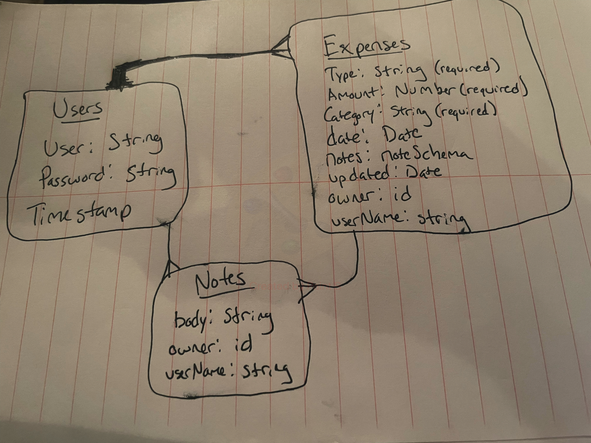

## eXpenses API

## TECH USED
 - Postman - Postman is an API client that makes it easy for developers to create, share, test and document APIs.
 - bcrypt - a password security platform.
 - cors - supports secure cross-origin requests and data transfers between browsers and servers.
 - dotenv - dotenv is a zero-dependency module that loads environment variables from a . env file into process. env.
 - express - Node web framework.
 - jsonwebtoken - a program for trasmitting information between parties as a JSON object.
 - method-override - object-oriented programming, is a language feature that allows a subclass or child class to provide a specific implementation of a method that is already provided by one of its superclasses or parent classes.
 - mongodb - open source NoSQL database management program.
 - mongoose - Mongoose is an Object Data Modeling (ODM) library for MongoDB and Node. js.
 - passport - Passport is authentication middleware for Node. js. 
 - passport-http-bearer - HTTP Bearer authentication strategy for Passport. 
 - GitHub - an online collaborative platform to share ideas and methods.

## USER ROUTES

| Verb   | URI Pattern            | Controller#Action |
|--------|------------------------|-------------------|
| POST   | `/sign-up`             | `users#signup`    |
| POST   | `/sign-in`             | `users#signin`    |
| PATCH  | `/change-password/`    | `users#changepw`  |
| DELETE | `/sign-out/`           | `users#signout`   |

## EXPENSE ROUTES

| Verb    | URI Pattern           | Controller#Action      |
|---------|-----------------------|------------------------|
| GET     | `/expenses`            | `index page`           |
| GET     | `/expenses/:id`        | `show page`            |
| POST    | `/addExpense`          | `create route`         |
| PATCH   | `/expenses/:id`        | `update route`         |
| DELETE  | `/expenses/:id`        | `delete route`         |

## ERD

 
